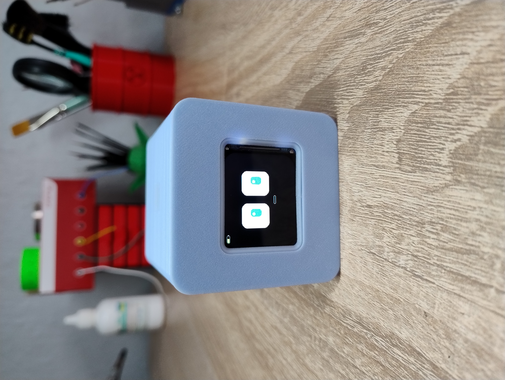

# Mimo Bot

<p align="center">
  
</p>
<p align="center">
  Compact DIY ESP32-S3 desktop robot with animated display, touch input, sound output, battery power, and a 3D printed enclosure.
</p>

---

## Overview

**Mimo Bot** is a compact DIY desktop robot built around an **ESP32-S3** and a **1.69" SPI IPS display**.

It is designed as a small interactive character with animated eyes, expressive UI, sound effects, clock and alarm features, and a clean futuristic look.

The goal of this project is to combine electronics, coding, 3D design, and personality into one build. Mimo Bot is not just a functional device, but a small digital companion that feels alive on your desk.

This build uses a custom animated interface, battery-powered electronics, and a 3D printed body. The project can be expanded with additional features such as weather display, touch interaction, status indicators, and more.

---

## Main features

- Animated robot face and expressions
- TFT screen UI with custom graphics
- Clock / idle display mode
- Alarm and notification animations
- Sound effects and feedback
- Battery-powered portable design
- 3D printable enclosure
- Expandable hardware and software platform

---

## Components required for assembly

- **ESP32-S3 Zero Type-C (4MB)** — main controller board
- **1.69" 240x280 rounded-corner SPI TFT display** — main screen for animations and UI
- **MAX98357A I2S mono class-D amplifier module** — audio output module
- **Small speaker** — for sound effects, notifications, and alarm
- **TP4056 Type-C charging module** — Li-Po battery charging board
- **DC-DC step-up converter (0.9–4.2V to 5V)** — voltage boost module
- **TTP223 touch sensor** — touch input control
- **3.7V 1000mAh Li-Po battery (803040)** — portable power source
- **Power switch** — main power control
- **Wires and connectors** — for internal wiring
- **Mounting hardware** — screws, spacers, and fasteners
- **3D printed body parts** — enclosure and structural parts

---

## Optional / recommended

- **Battery voltage divider / monitoring circuit** — for battery level indication
- **Custom PCB or prototype board** — for cleaner internal assembly
- **Rubber feet or soft pads** — for desktop stability

---

## License

This project uses separate licenses for software and design assets:

- **Firmware / source code:** MIT License
- **3D models, renders, and media files:** CC BY-NC-SA

### Summary

- The firmware code is open and reusable under the MIT License.
- The 3D models and visual assets may be used, remixed, and shared for personal and non-commercial purposes with proper credit.
- Commercial use of the design or media assets is not allowed without permission.

## Repository structure

```text
mimo-bot/
├─ images/
│  └─ mimo-cover.jpg
├─ mimo_bot/
│  ├─ mimo_bot.ino
│  ├─ alarm_manager.h
│  ├─ audio_manager.cpp
│  ├─ audio_manager.h
│  ├─ battery_manager.h
│  ├─ display_manager.h
│  ├─ event_queue.h
│  ├─ robot_brain.h
│  ├─ robot_types.h
│  ├─ settings_manager.h
│  ├─ touch_manager.h
│  └─ web_manager.h
├─ stl/
├─ .gitignore
├─ LICENSE
└─ README.md
